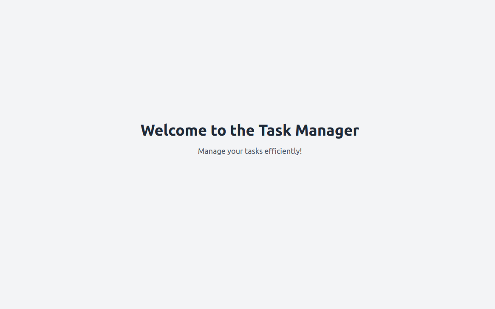

# Task Manager Application

## Overview
The Task Manager Application is a web-based platform designed to help users manage their tasks efficiently. It includes features for user authentication, task creation, and task management. The application is built using Django for the backend and React for the frontend, with PostgreSQL as the database.
 
<p float="left">
   
   
</p>

## Table of Contents

- [Overview](#overview)
- [Project Structure](#project-structure)
- [Setup Instructions](#setup-instructions)
- [Backend Development](#backend-development)
    - [Django Project Initialization](#django-project-initialization)
    - [Database Configuration](#database-configuration)
    - [Django Apps Creation](#django-apps-creation)
    - [Models Definition](#models-definition)
    - [Serializers Creation](#serializers-creation)
    - [Views Creation](#views-creation)
    - [URL Configuration](#url-configuration)
    - [Migrations](#migrations)
- [Frontend Development](#frontend-development)
- [Future Work](#future-work)
- [Contributing](#contributing)
- [License](#license)

## Project Structure

```
task_manager/
├── env/
├── frontend/
│   ├── src/
│   │   ├── components/
│   │   │   └── Navbar.js
│   │   │   └── ProtectedRoute.js
│   │   ├── context/
│   │   │   └── UserContext.js
│   │   ├── pages/
│   │   │   ├── HomePage.js
│   │   │   ├── LoginPage.js
│   │   │   ├── TaskPage.js
│   │   │   └── NotFoundPage.js
│   │   ├── services/
│   │   │   └── api.js
│   │   │   └── auth.js
│   │   └── App.js
│   ├── package.json
│   └── node_modules/
├── users/
│   ├── models.py
│   ├── views.py
│   ├── urls.py
│   └── serializers.py
├── tasks/
│   ├── models.py
│   ├── views.py
│   ├── urls.py
│   └── serializers.py
├── task_manager/
│   ├── settings.py
│   ├── urls.py
│   └── wsgi.py
└── manage.py
```

## Setup Instructions

### Prerequisites

- Python 3.8+
- Node.js and npm
- PostgreSQL

### Backend Setup

1. **Clone the repository:**
     ```bash
     git clone https://github.com/yourusername/task_manager.git
     cd task_manager
     ```

2. **Create and activate a virtual environment:**
     ```bash
     python3 -m venv env
     source env/bin/activate
     ```

3. **Install the required packages:**
     ```bash
     pip install django psycopg2-binary djangorestframework
     ```

4. **Configure PostgreSQL database:**
     Edit `task_manager/settings.py` to configure the PostgreSQL database:
     ```python
     DATABASES = {
             'default': {
                     'ENGINE': 'django.db.backends.postgresql',
                     'NAME': 'task_manager_db',
                     'USER': 'your_db_user',
                     'PASSWORD': 'your_db_password',
                     'HOST': 'localhost',
                     'PORT': '5432',
             }
     }
     ```

5. **Run migrations:**
     ```bash
     python manage.py makemigrations
     python manage.py migrate
     ```

6. **Run the development server:**
     ```bash
     python manage.py runserver
     ```

### Frontend Setup

1. **Navigate to the frontend directory:**
     ```bash
     cd frontend
     ```

2. **Install the required packages:**
     ```bash
     npm install
     ```

3. **Run the development server:**
     ```bash
     npm start
     ```

## Backend Development

### Django Project Initialization

- Initialized a Django project named `task_manager`.
- Configured the project to use PostgreSQL as the database.

### Database Configuration

- Configured PostgreSQL database settings in `settings.py`.

### Django Apps Creation

- Created two Django apps: `users` and `tasks`.

### Models Definition

- Defined the `User` model in `users/models.py`:
    ```python
    from django.db import models

    class User(models.Model):
            username = models.CharField(max_length=100, unique=True)
            email = models.EmailField(unique=True)
            password = models.CharField(max_length=100)
    ```

- Defined the `Task` model in `tasks/models.py`:
    ```python
    from django.db import models
    from users.models import User

    class Task(models.Model):
            user = models.ForeignKey(User, on_delete=models.CASCADE)
            title = models.CharField(max_length=255)
            description = models.TextField()
            completed = models.BooleanField(default=False)
            created_at = models.DateTimeField(auto_now_add=True)
            updated_at = models.DateTimeField(auto_now=True)
    ```

### Serializers Creation

- Created serializers for `User` and `Task` models.

### Views Creation

- Created viewsets for `User` and `Task` models.

### URL Configuration

- Configured URLs to include routes for the viewsets.

### Migrations

- Ran initial migrations to create database tables.

## Frontend Development

- Initialized a React project.
- Created basic components for task list and user profile.
- Set up routing for the application.

## Future Work

- Implement user authentication and authorization.
- Develop more features for task management.
- Integrate gamification and AI-driven features.
- Set up CI/CD pipelines using GitHub Actions or Jenkins.

## Contributing

Contributions are welcome! Please read the [contributing guidelines](CONTRIBUTING.md) before submitting a pull request.

## License

This project is licensed under the MIT License. See the LICENSE file for details.

## TODO

### Next Phases

1. **User Authentication and Authorization**:
   - Implement user roles and permissions.
   - Add password reset functionality.
   - Enhance security measures for user data.

2. **Task Management Features**:
   - Add task categories and tags.
   - Implement task prioritization.
   - Develop task filtering and sorting options.

3. **Frontend Enhancements**:
   - Improve the user interface with modern design practices.
   - Add responsive design for mobile devices.
   - Implement real-time updates using WebSockets.

4. **Testing and Quality Assurance**:
   - Write comprehensive unit and integration tests.
   - Perform user acceptance testing (UAT).
   - Set up continuous integration and deployment (CI/CD) pipelines.

5. **Documentation and Support**:
   - Create detailed API documentation.
   - Develop user guides and tutorials.
   - Set up a support system for users.

6. **Gamification and AI Features**:
   - Integrate gamification elements to enhance user engagement.
   - Implement AI-driven task suggestions and insights.

7. **Scalability and Performance**:
   - Optimize database queries and API responses.
   - Implement caching strategies.
   - Plan for horizontal scaling.

8. **Community and Collaboration**:
   - Open the project for community contributions.
   - Set up a feedback mechanism for users.
   - Organize community events and hackathons.

### Changes Made 26.09.2024

1. **Inheritance from `AbstractUser` in `User` Model**:
   - **Why**: To ensure the custom `User` model includes all necessary methods and attributes required by Django's authentication system.
   - **What**: Changed the custom `User` model to inherit from `AbstractUser` instead of `models.Model`.

2. **Field Definitions in `User` Model**:
   - **Why**: To ensure custom fields like `username`, `email`, and `password` are compatible with `AbstractUser`.
   - **What**: Defined these fields in the custom `User` model.

3. **`REQUIRED_FIELDS` and `USERNAME_FIELD` in `User` Model**:
   - **Why**: To specify which fields are required and which field is used for authentication.
   - **What**: Set `REQUIRED_FIELDS` to `['email']` and `USERNAME_FIELD` to `username`.

4. **`AUTH_USER_MODEL` Setting in `settings.py`**:
   - **Why**: To inform Django to use the custom `User` model for authentication and user management.
   - **What**: Set `AUTH_USER_MODEL` to `'users.User'`.

5. **Database Migrations**:
   - **Why**: To update the database schema to reflect the changes made to the custom `User` model.
   - **What**: Ran `python manage.py makemigrations` and `python manage.py migrate`.

6. **Added `__str__` Method to `Task` Model**:
   - **Why**: To fix the test failure related to the string representation of the `Task` model.
   - **What**: Added the `__str__` method to the `Task` model to return the `title` of the task.

### Summary

- **Updated Custom `User` Model**: Ensured compatibility with Django's authentication system.
- **Verified `settings.py`**: Set `AUTH_USER_MODEL` to use the custom `User` model.
- **Migrated Database**: Updated the database schema.
- **Fixed `Task` Model Test**: Added `__str__` method to return the `title` of the task.

### Task Manager Application - Detailed Description for CoPilot

**Project Overview:**
Develop a task manager application with a focus on backend development to improve backend skills. This application will initially be a simple task manager and later evolve into a gamified service. 

**Objective:**
Create a robust backend for managing tasks, users, and interactions. Implement a basic frontend to interact with the backend. Expand the project to include gamification and AI-driven features.

**Technical Stack:**
- **Backend Framework:** Django (Python)
- **Frontend Framework:** React (JavaScript)
- **Database:** PostgreSQL
- **API:** RESTful APIs
- **Version Control:** Git
- **Development Environment:** VS Code with CoPilot
- **CI/CD Tools:** GitHub Actions or Jenkins

**Backend Development Steps:**

1. **Project Initialization:**
   - Set up a Git repository for version control.
   - Initialize Django project and configure PostgreSQL database.

2. **Database Models:**
   - Define Django models for tasks and users.
   - Example:
     ```python
     from django.db import models

     class User(models.Model):
         username = models.CharField(max_length=100, unique=True)
         email = models.EmailField(unique=True)
         password = models.CharField(max_length=100)

     class Task(models.Model):
         user = models.ForeignKey(User, on_delete=models.CASCADE)
         title = models.CharField(max_length=255)
         description = models.TextField()
         completed = models.BooleanField(default=False)
         created_at = models.DateTimeField(auto_now_add=True)
         updated_at = models.DateTimeField(auto_now=True)
     ```

3. **API Development:**
   - Create RESTful APIs using Django REST Framework.
   - Example API views for tasks:
     ```python
     from rest_framework import viewsets
     from .models import Task
     from .serializers import TaskSerializer

     class TaskViewSet(viewsets.ModelViewSet):
         queryset = Task.objects.all()
         serializer_class = TaskSerializer
     ```

4. **User Authentication:**
   - Implement user registration and authentication.
   - Use Django's built-in authentication system or Django REST Framework's authentication classes.

5. **Frontend Integration:**
   - Develop React components to interact with backend APIs.
   - Example component for listing tasks:
     ```javascript
     import React, { useState, useEffect } from 'react';
     import axios from 'axios';

     function TaskList() {
         const [tasks, setTasks] = useState([]);

         useEffect(() => {
             axios.get('/api/tasks/')
                 .then(response => setTasks(response.data))
                 .catch(error => console.error('Error fetching tasks:', error));
         }, []);

         return (
             <div>
                 <h1>Task List</h1>
                 <ul>
                     {tasks.map(task => (
                         <li key={task.id}>{task.title} - {task.completed ? 'Completed' : 'Pending'}</li>
                     ))}
                 </ul>
             </div>
         );
     }

     export default TaskList;
     ```

6. **Testing and Validation:**
   - Write unit tests for backend APIs and frontend components.
   - Example Django test case:
     ```python
     from django.test import TestCase
     from .models import Task

     class TaskModelTest(TestCase):
         def test_task_creation(self):
             task = Task.objects.create(title='Test Task', description='Test Description')
             self.assertEqual(task.title, 'Test Task')
             self.assertFalse(task.completed)
     ```

7. **CI/CD Setup:**
   - Configure GitHub Actions or Jenkins for continuous integration and deployment.
   - Example GitHub Actions configuration:
     ```yaml
     name: CI/CD Pipeline

     on:
       push:
         branches:
           - main

     jobs:
       build:
         runs-on: ubuntu-latest
         steps:
           - uses: actions/checkout@v2
           - name: Set up Python
             uses: actions/setup-python@v2
             with:
               python-version: '3.9'
           - name: Install dependencies
             run: |
               python -m pip install --upgrade pip
               pip install -r requirements.txt
           - name: Run tests
             run: |
               python manage.py test
           - name: Deploy
             run: |
               echo "Deploying application..."
               # Add deployment commands here
     ```

**Future Expansion:**
- Add gamification features such as experience points and task ratings.
- Integrate AI for advanced task management and user interaction.

**Notes:**
- Emphasize backend development for a strong foundation.
- Plan for incremental updates and scalability.
- Its not yet completed

**Example curl commands:**
```
# Registers a new user
curl -X POST http://localhost:8000/api/register/ \
-H "Content-Type: application/json" \
-d '{
    "username": "testuser",
    "email": "testuser@example.com",
    "password": "testpassword123"
}'

# Logs in to get token
curl -X POST http://localhost:8000/api/login/ \
-H "Content-Type: application/json" \
-d '{
    "username": "your_username",
    "password": "your_password"
}'

#Example of using the token
curl -H "Authorization: Bearer <your_token>" http://localhost:8000/api/

```